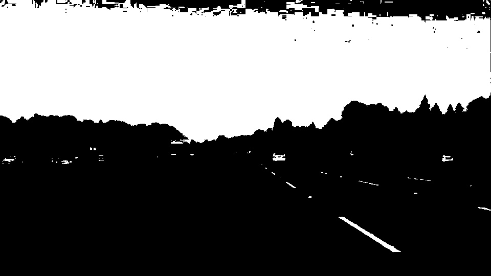
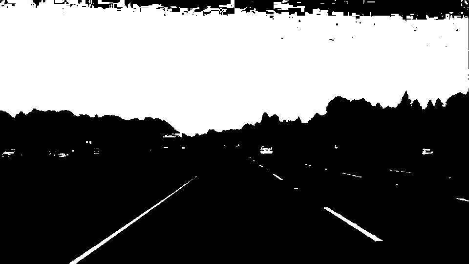
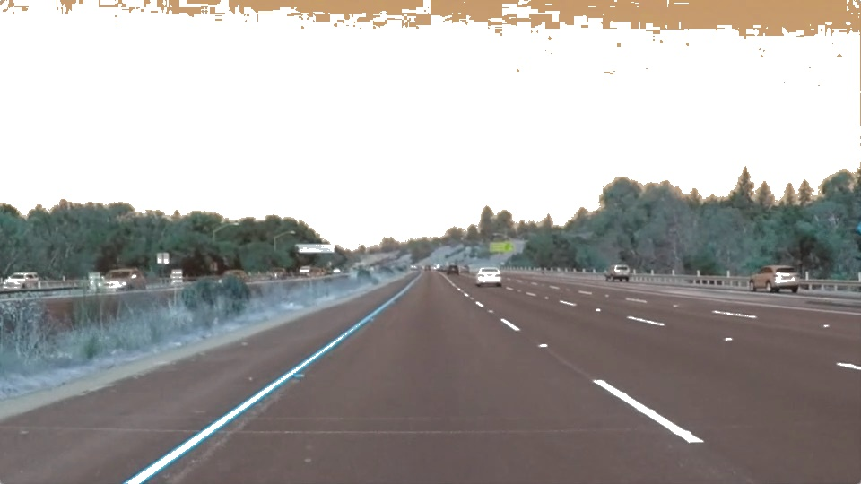
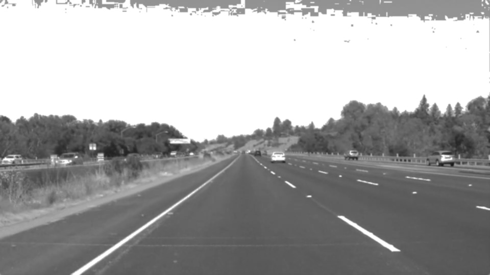
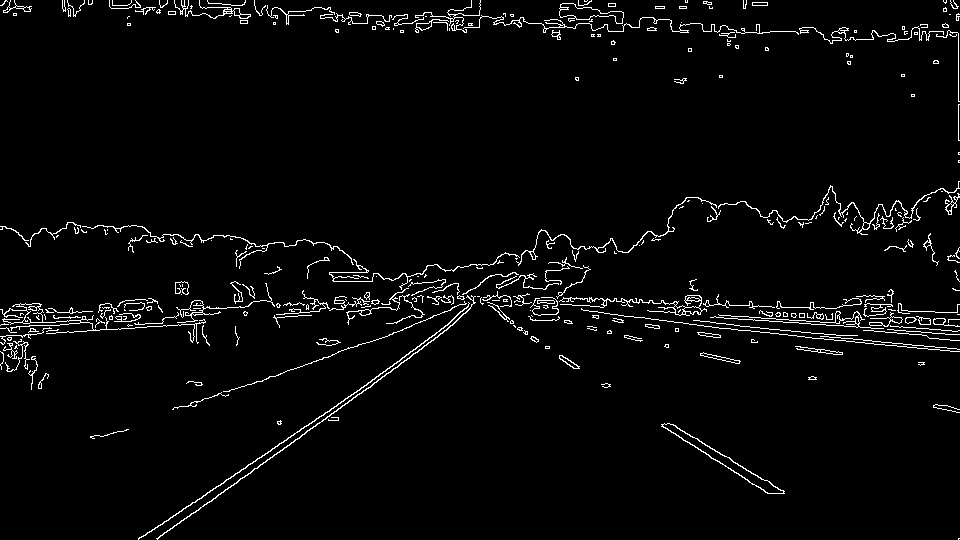
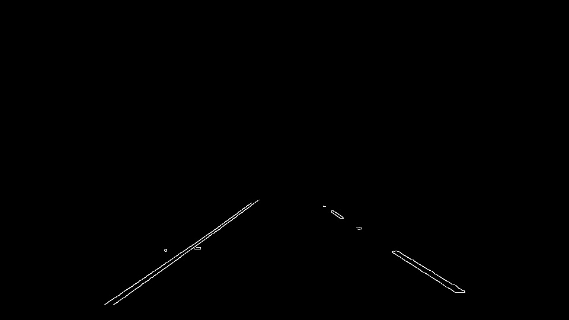
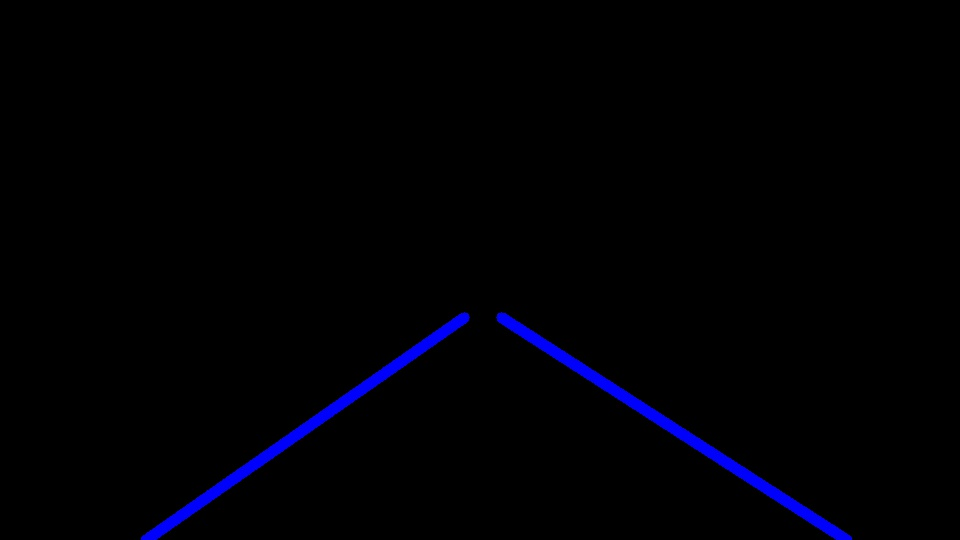
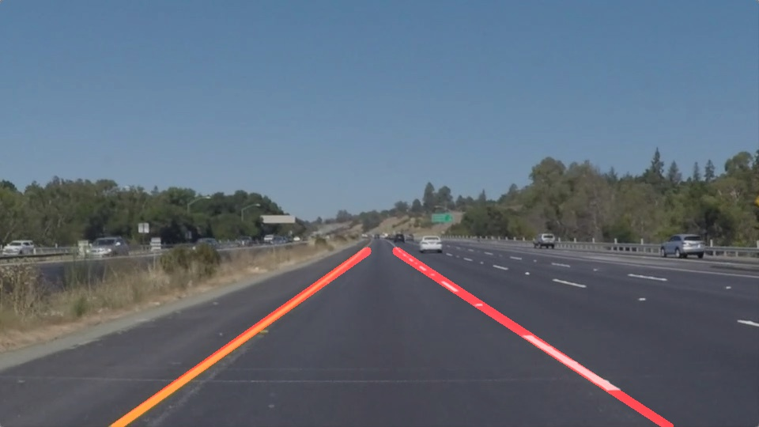

# **Finding Lane Lines on the Road** 

---

**Finding Lane Lines on the Road**

The goals / steps of this project are the following:
* Make a pipeline that finds lane lines on the road.
* Reflect on your work in a written report

---
### Note
All challenges were attempted including the 'Optional' challenge

### Reflection

### 1. Describe your pipeline. As part of the description, explain how you modified the draw_lines() function.

My pipeline consisted of 9 steps. 
1. First, I masked the white colour

2. After that I masked the yellow colour

3. Combined white and yellow mask

4. Then I applied the combined mask to the images

5. The images were converted to grayscale

6. I applied Gaussian smoothing

7. I subsequently applied Canny Edge Detection to detect edges

8. Then I created region of interest of the left and right lines that I was interested in (+ their top and bottom boundaries)

9. Later on I calculated a list of lines using Hough Transform and extrapolated/thickened the lines accordingly. In order to draw a single line on the left and right lanes, I modified the draw_lines() function by: 
  
  * Iterating each line
  * Calculating its slope
  * Finding the center x, y position of the line
  * If the calculated slope fell within the specific boundary values, calculated values of both slope and position were added into separate lists
  * Then I calculated average slope and average center position
  * Using the average slope and center positions and knowing the top and bottom y positions that I wanted, I calculated the top and bottom x positions using y-y1 = m(x-x1) formula
  * Subsequently, I called cv2.line method passing the original image, coordinates of both points, color and thickness of the line to be drawn

9. Finally I blended the lines and the original image

### 2. Identify potential shortcomings with your current pipeline

One potential shortcoming would be what would happen when there is no line on the road as the algorithm heavily depends on the ability to detect presence of line 

Another shortcoming could be shadows, light and darkness could potentially affect the algorithm as it heavily relies on presence/ absence of colours

### 3. Suggest possible improvements to your pipeline

A possible improvement would be to instead of using RGB channel, we could use HSV channel and target saturation or value (brightness) channels instead

Another potential improvement could be to reduce the range of values the calculated slopes could have as this would reduce the jerkiness of the drawn red lines on the right and left lanes.
